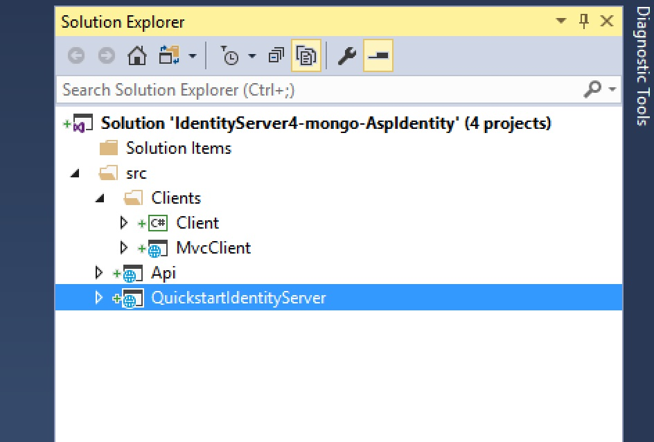

# IdentityServer4 Sample for  MongoDB  

IdentityServer4 samples that shows how to use MongoDB for the configuration data. These sample  are based on [IdentityServer4.quickstart.samples](https://github.com/IdentityServer/IdentityServer4.Samples). 

## Solution overview: 

This repo contains 02 samples based on MongoDB:

1. __IdentityServer4-mongo__: Similar to [Quickstart #8: EntityFramework configuration] (https://github.com/IdentityServer/IdentityServer4.Samples/tree/release/Quickstarts/8_EntityFrameworkStorage) but using MongoDB for the configuration data. 

2. __IdentityServer4-mongo-AspIdentity__: More elaborated sample  based on uses ASP.NET Identity for identity management that uses using MongoDB for the configuration data.  

Each Sample Solution listed above is composed of:

* _QuickstartIdentityServer_ -  project based on IdentityServer4 that manages authentication
* _API_ - is a sample API project, used by  client/* projects to showcase QuickstartIdentityServer functionality
* _clients/MvcClient_ - Asp .Net Core mvc  client project sample
* _clients/Client_ - .NET Core console client project sample

### Technical dependencies

* Solution is based on Visual Studio 2017.
* ASP .Net Core
* Nugets:
	* [MongoDB.Driver](https://www.nuget.org/packages/MongoDB.Driver/)
	* [Microsoft.AspNetCore.Identity.MongoDB](https://www.nuget.org/packages/Microsoft.AspNetCore.Identity.MongoDB/)  - for _IdentityServer4-mongo-AspIdentity_ sample.

- - - -

## Running the solution

Getting one of those sample project up and running on your machine should be fairly straightforward one you have any MongoDB running.

* If you __do not have MongoDB__ in your environment or wish to run it locally  - take a look at [Setup mongo](./mongodb.md)

1. With mongo depency resolved, open the selected project in Visual Studio.
2. Make sure you have multiple projects selected to startup - "QuickstartIdentityServer", "Api" and any desired client (e.g. Clients\MvcClient) before executing solution from Visual Studio - see screenshots below:

__First execution__: You should get an execption - The first execution will automatically create a new Mongo  Repository (database), but due to MongoDB.Driver limitations it is necessary to restart the solution in order to proper configure MongoDB to ignore Extra Elements such as  "_id" that does not exist in IdentityServer4.Models classes.

 
### Next steps

*  [Setup mongo](./mongodb.md)

*  [Mongo Implementation overview](./MongoImplementation.md)

