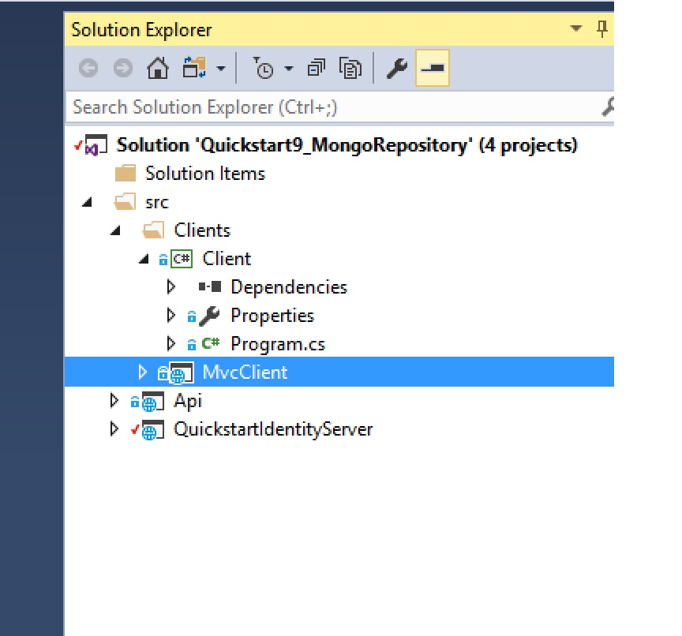

# IdentityServer4 with  MongoDB configuration 

This project is based on [IdentityServer4.quickstart.samples](https://github.com/IdentityServer/IdentityServer4.Samples) and aims to shows how to use MongoDB for the configuration data.

#### Solution overview: 

- Solution is based on Visual Studio 2017.
- QuickstartIdentityServer -  project based on IdentityServer4 that will manage all authentication
- API - is a sample API project.
- clients/MvcClient - ASP .NET Core project sample
- clients/Client - .NET Core console project sample

#### QuickstartIdentityServer project 

TODO - add text here

 
#### Next steps

[Setup mongo](./momgo.md)
[Running solution](./running.md)
[FAQ](./faq.md)

