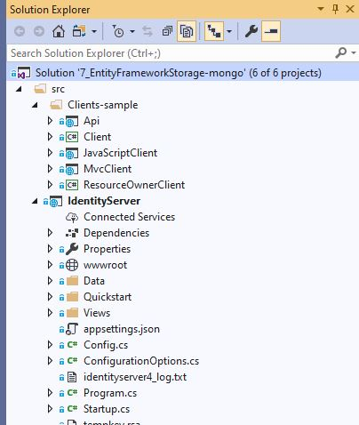
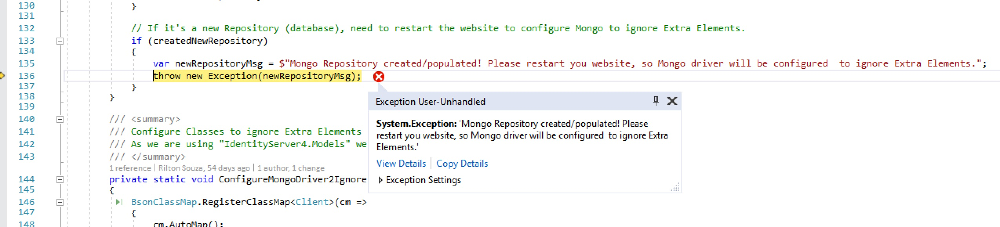
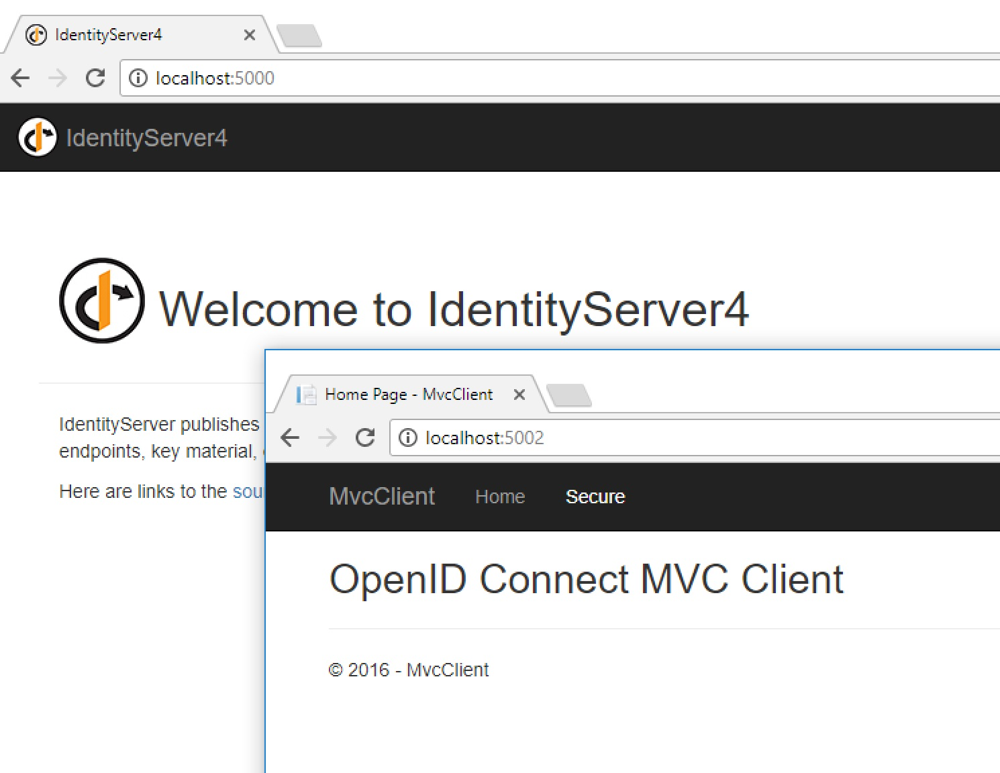
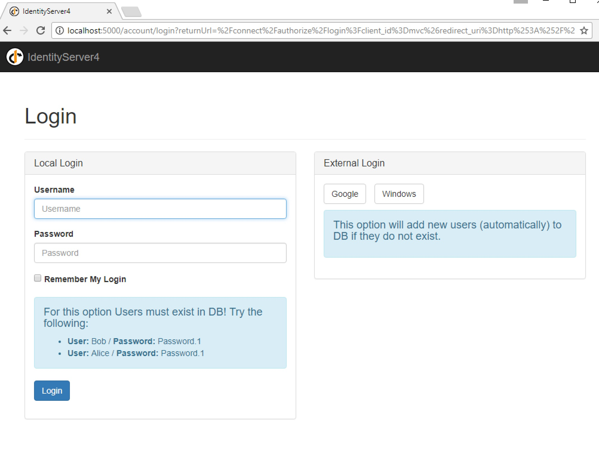

# IdentityServer4 Sample for  MongoDB  

__7_EntityFrameworkStorage-mongo__: Based on [Quickstart #7: Using EntityFramework Core for configuration and operational data](https://github.com/IdentityServer/IdentityServer4/tree/master/samples/Quickstarts/7_EntityFrameworkStorage) but using MongoDB for the configuration data. 

Note: In order to better support this repo moving forward, we will only maintain one quicksample based on MongoDB.

Each Sample Solution listed above is composed of:

* _IdentityServer_ -  project based on IdentityServer4 that manages authentication
* _API_ - is a sample API project, used by  client/* projects to showcase QuickstartIdentityServer functionality
* _clients/MvcClient_ - Asp .Net Core mvc  client project sample
* _clients/Client_ - .NET Core console client project sample

### Technical dependencies 

* Solution is based on Visual Studio 2019.
* ASP .Net Core 2.2 
* Most relevant Nugets:
	* [MongoDB.Driver](https://www.nuget.org/packages/MongoDB.Driver/)

- - - -

## Running the solution

Getting one of those sample project up and running on your machine should be fairly straightforward once you have any MongoDB running.

* If you __do not have MongoDB__ in your environment or wish to run it locally please take a look at [Setup mongo](./mongodb.md)

1. With mongo depency resolved, open the selected project in Visual Studio.
2. Make sure you have multiple projects selected to startup - "IdentityServer", "Api" and any desired client (e.g. Clients\MvcClient) before executing solution from Visual Studio - see screenshots below:

### __First execution__

In your very first execution you should get an exception stating that "Mongo Repository was created/populated! Please restart your website..."

This is because the first execution will automatically create a new Mongo  Repository (database), but due to MongoDB.Driver limitations it is necessary to restart the solution in order to proper configure MongoDB to ignore Extra Elements such as  "_id" that does not exist in IdentityServer4.Models classes.

### __Authentication__
Once the MongoDB is created, you should see two browser tabs, one related to the MvcClient and the other related to QuickstartIdentityServer. 
In the Click on "Secure" menu
In the the MvcClient, click on "secure", you will be redirected to  QuickstartIdentityServer authentication page  - it is almost identical to all original  [IdentityServer4.Samples](https://github.com/IdentityServer/IdentityServer4.Samples/), but for your convinience we took the opportunity to display a some sample user/password that were automatically added to the MongoDB.

### Aditional information

*  [Setup mongo locally](./mongodb.md)

*  [IdentityServer4 Mongo implementation overview](./MongoImplementation.md)

