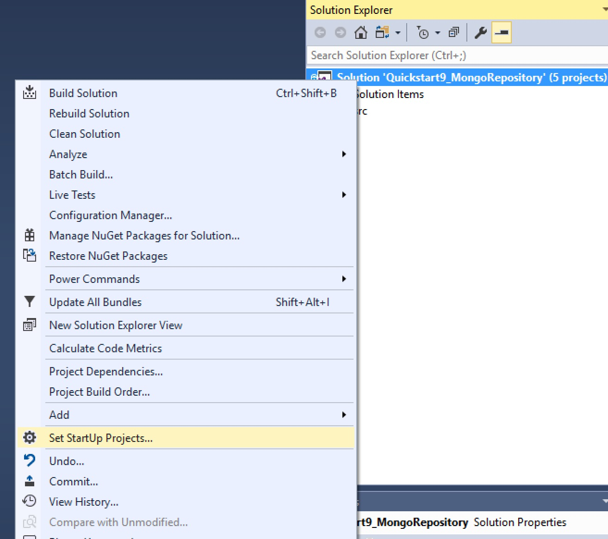
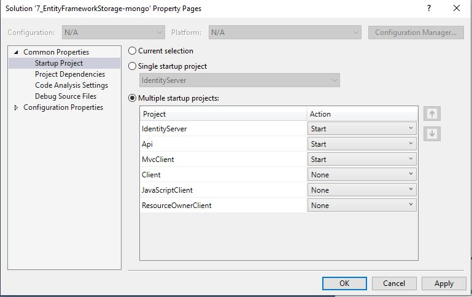

## Running samples from Visual Studio
Make sure you have multiple projects selected to startup - "QuickstartIdentityServer", "Api" and any desired client (e.g. Clients\MvcClient) before executing solution from Visual Studio.

The first execution will create a  new Mongo  Repository (database), after that due to MongoDB.Driver limitations it is necessary to restart the website in order to proper configure Mongo to ignore Extra Elements such as  "_id" that does not exist in IdentityServer4.Models classes.
